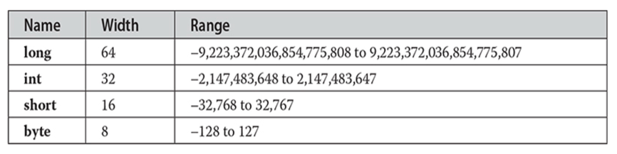
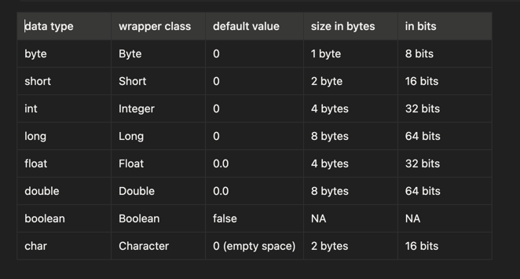

Java Is a Strongly Typed Language
It is important to state at the outset that Java is a strongly typed language. 
Indeed, part of Java’s safety and robustness comes from this fact. Let’s see what this means. First,
every variable has a type, every expression has a type, and every type is strictly
defined. Second, all assignments, whether explicit or via parameter passing in method
calls, are checked for type compatibility. There are no automatic coercions or
conversions of conflicting types as in some languages. 
The Java compiler checks all expressions and parameters to ensure that the types are compatible. Any type
mismatches are errors that must be corrected before the compiler will finish compiling
the class.

The Primitive Types
Java defines eight primitive types of data: byte, short, int, long, char, float, double, and boolean. 
The primitive types are also commonly referred to as simple types, and both terms will be used in this book. 
These can be put in four groups:
• Integers This group includes **byte**, **short**, **int**, and **long**, which are for whole-
valued signed numbers.
• Floating-point numbers This group includes **float** and **double**, which represent
numbers with fractional precision.
• Characters This group includes **char**, which represents symbols in a character
set, like letters and numbers.
• Boolean This group includes boolean, which is a special type for representing
**true/false** values.

An int
is always 32 bits, regardless of the particular platform. This allows programs to be
written that are guaranteed to run without porting on any machine architecture.

Java defines four integer types: byte, short, int, and long. All of these are signed, positive and negative values. 
Java does not support unsigned, positive-only integers. Many other computer languages support both signed and unsigned integers. 
However, Java’s designers felt that unsigned integers were unnecessary.

n Java, positive integers are stored in their regular binary form, while negative integers are stored using 2’s complement representation.

How Java stores numbers in memory
• Positive numbers → stored as normal binary (example: 5 → 0000 0101 in 8-bit representation).
• Negative numbers → stored in two’s complement
Example:
-5
Step 1: Binary of +5 → 0000 0101
Step 2: Invert bits → 1111 1010
Step 3: Add 1 → 1111 1011 → this is -5 in memory.

Why 2’s complement?
• Only one zero (0000…0000).
• Simplifies addition/subtraction.
• Hardware-friendly representation.

**Integer overflow** in Java happens when the result of an arithmetic operation exceeds the maximum or minimum value that the data type can store. 
Java’s integer types (byte, short, int, long) use fixed-size memory and 2’s complement representation, 
so they wrap around instead of throwing an error.

Why does Java NOT throw an error?

Because:
• Arithmetic is done in fixed-size registers.
• Any bits beyond 32-bits (for int) are discarded.
• This is how 2’s complement hardware naturally behaves.

How to detect/avoid overflow
Use Math.addExact, subtractExact, multiplyExact
These throw ArithmeticException on overflow.

JVM-level integer overflow — short & precise
• Fixed size primitives
    int = 32 bits, long = 64 bits. Size is defined by the JVM spec, not by OS/CPU.
• Two’s complement arithmetic
    JVM uses 2’s complement for all signed integers.
• No overflow checks by default
    JVM bytecode instructions like iadd, isub, imul, ineg do not check overflow.
• Extra bits are discarded
    Arithmetic is done, then only the lowest N bits (32 for int, 64 for long) are kept.
    Higher bits are silently dropped.
• Wrap-around behavior
    Max + 1 → Min
    Min − 1 → Max
    This is a natural result of bit truncation.
• Why JVM allows this
    Matches CPU behavior
    Faster execution (no extra checks)
    Predictable and platform-independent
• Math.*Exact methods
    Implemented in Java library
    Add explicit overflow checks
    Throw ArithmeticException
    JVM itself still does unchecked arithmetic

The JVM performs integer arithmetic using fixed-width two’s complement instructions and silently truncates excess bits, 
causing wrap-around instead of overflow exceptions.

**byte**
The smallest integer type is byte. This is a signed 8-bit type that has a range from –128
to 127. Variables of type byte are especially useful when you’re working with a stream
of data from a network or file. They are also useful when you’re working with raw
binary data that may not be directly compatible with Java’s other built-in types.

X	  1	      1	      1	      1	      1	      1	      1
MSB	$2^6$	$2^5$	$2^4$	$2^3$	$2^2$	$2^1$	$2^0$

X → MSB → Most significant bit acts as sign bit

If its 0 → then positive

if its 1 → then negative

Remaining 7 bits represent values.

in above example = 64 + 32 + 16 + 8 + 4 + 2 + 1 = 127

**short**
short is a signed 16-bit type. It has a range from –32,768 to 32,767. It is probably the
least-used Java type.

int
The most commonly used integer type is int. It is a signed 32-bit type that has a range from –2,147,483,648 to 
2,147,483,647. In addition to other uses, variables of type int are commonly employed to control loops and to 
index arrays. Although you might think that using a byte or short would be more efficient than using an int in 
situations in which the larger range of an int is not needed, this may not be the case. The reason is that when 
byte and short values are used in an expression, they are promoted to int when the expression is evaluated. 
Therefore, int is often the best choice when an integer is needed. 
**By default, compiler, considers every integral as ‘int’**

**short**
short is a signed 16-bit type. It has a range from –32,768 to 32,767. It is probably the
least-used Java type.
Range:  -2^15  to 2^15 - 1
**max value =  + 32767**
**min value =    -32768**

**int**
size: 4 bytes [ 32 bits ]
Range: -2^31 to 2^31 - 1
max value: 2147483647
min value: -2147483648

1. **long**
size: 8 bytes [ 64 bits ]
Range: -2^63 to 2^63 - 1
**number of characters present in big files may exceed int range hence return type of length() method is long**
long l = file.length();

Floating point numbers:
**float**: 5 to 6 decimal places accuracy 
size 4 bytes
Range: -3.4E-38 to 3.4E-38

**double**
14 to 15 decimal places accuracy
double precision
size 8 bytes
size: -1.7E308 to 1.7E308

**Decimal literals are treated as double by default.**
A float variable cannot hold a double value directly because float **has less precision** (32-bit) compared to double (64-bit).
To assign a decimal literal to a float, you must use a **type suffix** f or F to indicate it’s a float.

**char**
java is UNICODE based and number of different Unicode's are greater than 256 and less than or equal to 65536.
To represent these many characters 8 bits may not be enough, we should go for 16 bits.
size: 2 bytes [ 16 bits ]
Range: 0 to 65535
In the formal specification for Java, char is referred to as an integral type, which means that it is in the same
general category as int, short, long, and byte. However, because its principal use is for representing Unicode
characters, char is commonly considered to be in a category of its own.

**float**
The type float specifies a single-precision value that uses 32 bits of storage. Single
precision is faster on some processors and takes half as much space as double
precision, but will become imprecise when the values are either very large or very
small. Variables of type float are useful when you need a fractional component but
don’t require a large degree of precision. For example, float can be useful when
representing dollars and cents.

float hightemp, lowtemp;

**double**
Double precision, as denoted by the double keyword, uses 64 bits to store a value.
Double precision is actually faster than single precision on some modern processors
that have been optimized for high-speed mathematical calculations. All transcendental
math functions, such as sin( ), cos( ), and sqrt( ), return double values. When you need
to maintain accuracy over many iterative calculations, or are manipulating large-valued
numbers, double is the best choice.

